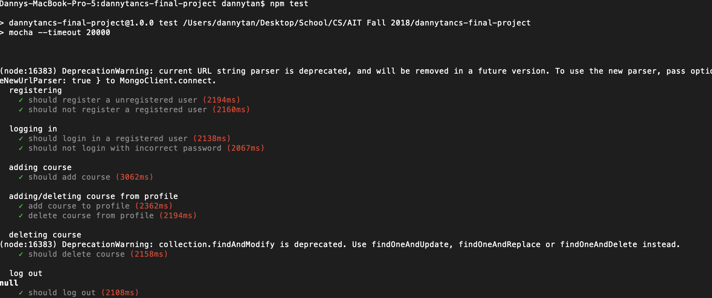
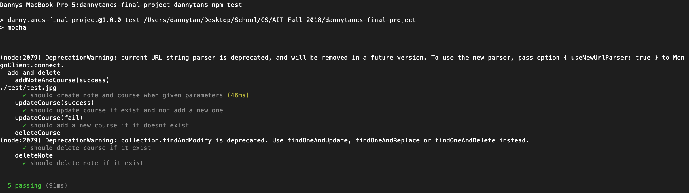
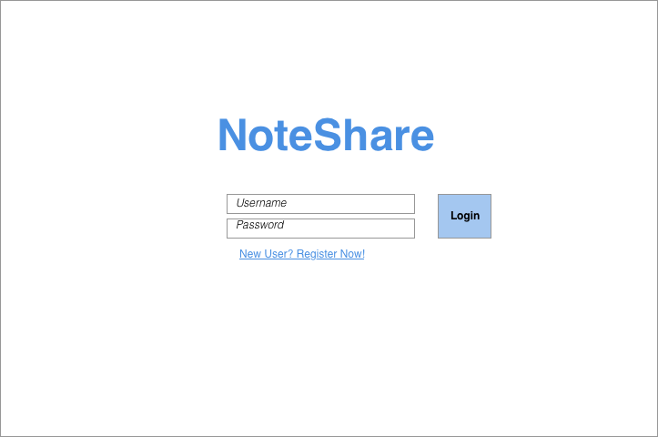
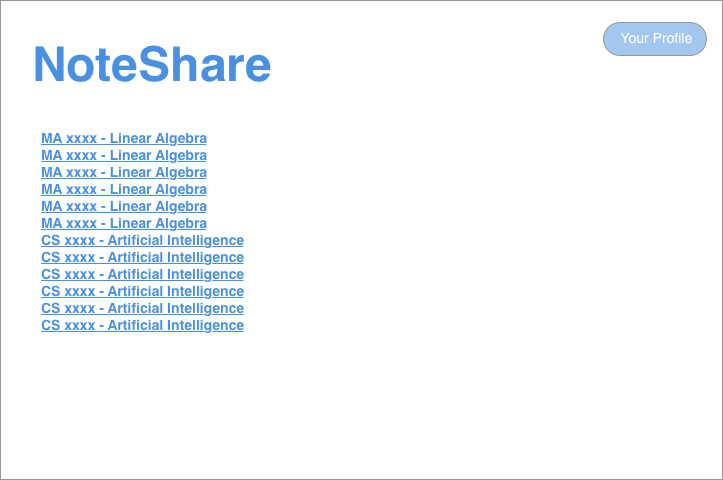
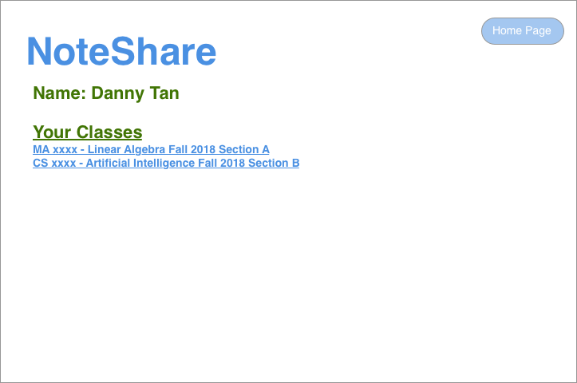
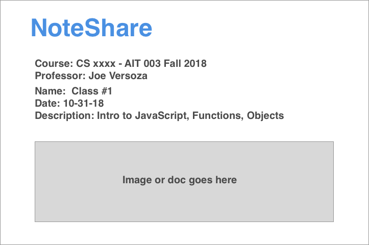

# NoteShare

## Overview:

NoteShare is a web application that allows users to upload class notes and view uploaded class notes. 
Users can register and login. Once they logged in, they can search for the class they are in. 
They can add the class to their profile page for easy access. For each class, users can upload or view the notes for that class.
Users can also delete notes if the notes were wrong.

## To Run:

Should open mongod in another tab before running
```
mongod
```


```
npm install
cd src/
node app.js
```
go to localhost:3000


## Automated Testing/ Unit Testing:

Should open mongod in another tab before testing
```
mongod
```

Should run program in another tab before running automated testing
```
node app.js
```

```
npm test

```

### Automated Testing
[Link to automated testing](test/seleniumTest.js)


### Unit Testing

[Link to unit test](test/test.js)


## Data Model:

An Example User:

```javascript
{
  username: "dannytan",
  name: Danny Tan
  password: // a password hash,
  lists: // an array of references to classes
}
```


An Example Class:

```javascript
class {
    name: AIT
    date: Fall 2018
    courseName: CS-UA.480
    professor: Joe Versoza
    notes: // an array of references to notes
}
```


An Example of Note:

```javascript
note {
    name: Class #1
    desc: Intro to JavaScript, Functions, Objects
    date: //date taken
    file: //an image or document
}
```
[Link to Commented First Draft Schema](src/db.js) 

## Wireframe:

### Login Page:



### Class/Home Page:



### Profile Page:



### Notes Page:




## SiteMap:


## Use Cases:

1. As a non-registered, I can register a new account with the site
2. As a registered user, I can log into the site
3. As a registered user, I can add classes to my profile page
4. As a registered user, I can upload notes for a class
5. As a registered user, I can delete wrong notes from a class
6. As a registered user, I can view all of the uploaded notes


## Research Topic:

* (3 points) Unit testing with JavaScript
    * Write unit test using Jasmine or Mocha
* (5 points) Automated functional testing for all of your routes using any of the following
    * Write automated testing using Selenium or Headless Chrome

* (2 points) Use a CSS framework throughout your site, use a reasonable of customization of the framework
    * Use Boostrap


